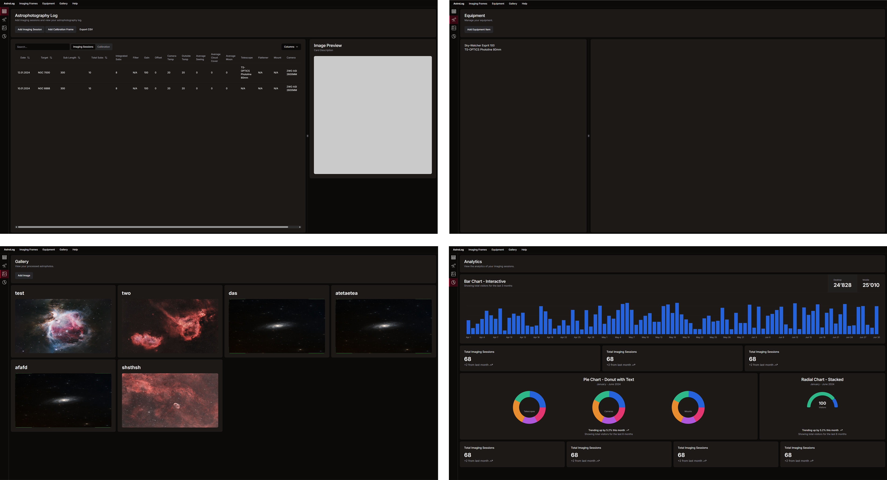

# AstroLog

AstroLog is an astrophotography application that lets you log and classify all your imaging sessions - by its own or manually.



## Getting Started

> [!WARNING]  
> You can't activate your AstroLog license in development mode, only in the [compiled version](https://astro-log.app/download/).

**To run AstroLog locally you have to follow these steps:**

1. Follow the [prerequisites](https://v2.tauri.app/start/prerequisites/).
2. Install node dependencies:

```sh
npm i
```

3. Install tauri CLI:

```sh
cargo install tauri-cli
```

4. Start AstroLog in development mode:

```sh
cargo tauri dev
```

## Contributing

**Contributing will be possible after the official release of AstroLog.**
<br />
You can get notified when AstroLog releases by signing up to the [waitlist](https://astro-log.app).
